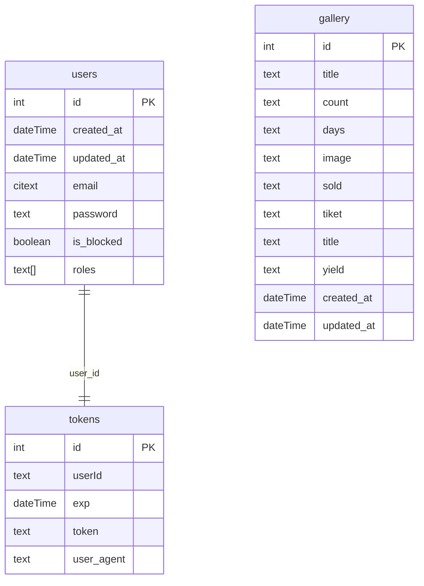

## 1. Database Schema

#### 2 Folder Structure

Frontend

1. assets - static assets (images, global styles)
2. libs - shared libraries and utilities

   2.1 components - plain react components

   2.2 enums

   2.3 helpers

   2.4 hooks

   2.5 modules - separate features or functionalities

   2.6 types

3. modules - separate app features or functionalities
4. pages - app pages

   Backend

5. db - database data (migrations, seeds)
6. libs - shared libraries and utilities

   2.1 enums

   2.2 exceptions

   2.3 helpers

   2.4 modules - separate features or functionalities

   2.5 types

7. modules - separate app features or functionalities

   Shared Package

## 4. How to Run

### 4.1 Manually

1. Create and fill all .env files. These files are:

- apps/frontend/.env
- apps/backend/.env

You should use .env.example files as a reference.

1. Install dependencies: `npm install`.

1.1 Move to backend folder: `npm install`.

2. Run database. You can run it by installing postgres on your computer.

3. Apply migrations in backend folder: `npx prisma migrate dev`

4. Run backend in backend folder: `npm run start`

5. Run frontend `npm run start:dev -w apps/frontend`
